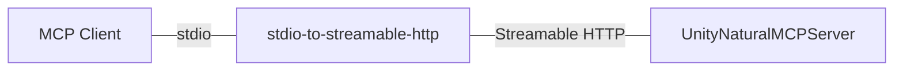

# UnityNaturalMCP

[日本語](README_JP.md)

UnityNaturalMCP is an MCP server implementation for Unity that aims for a "natural" user experience.

MCP tools defined in Unity C# can be directly used from MCP clients such as ClaudeCode and Cursor.

## Features
- Concise communication flow between Unity Editor and MCP clients
- stdio/Streamable HTTP support
- Implementation of extended MCP tool entirely written in C# using [ModelProtocolContext C# SDK](https://github.com/modelcontextprotocol/csharp-sdk)
- ClaudeCode support

## Architecture


### UnityNaturalMCPServer
An MCP server implementation provided as a Unity Package that behaves as a Streamable HTTP server.

Streamable HTTP-compatible clients can communicate with Unity Editor through this server alone.

### stdio-to-streamable-http
A Node.js-based stdio MCP server that relays communication between MCP clients and Unity.

Some MCP clients, such as ClaudeCode, do not support Streamable HTTP.

By bypassing stdio input to Streamable HTTP, it enables communication between UnityNaturalMCPServer and MCP clients.

### UnityNaturalMCPTest
A Unity project for functional verification and as a sample.

## MCP Tools
Currently, the following MCP tools are implemented:

- **RefreshAssets**: Refresh Unity Editor assets
- **GetLogHistory**: Get Unity Console log history

## Requirements
- Unity 6000.0
- Node.js

## Installation

### Unity
The following packages are required:
- [UniTask](https://github.com/Cysharp/UniTask)
- [NugetForUnity](https://github.com/GlitchEnzo/NuGetForUnity)

Also, install the following Nuget Packages via NugetForUnity:
- [System.Text.Json](https://www.nuget.org/packages/System.Text.Json/)
- [ModelContextProtocol](https://www.nuget.org/packages/ModelContextProtocol/)
- [Microsoft.Extensions.DependencyInjection](https://www.nuget.org/packages/Microsoft.Extensions.DependencyInjection/)

> [!WARNING]
> ModelContextProtocol is still in preview stage. When installing via NugetForUnity, you need to enable the `Show Prerelease` toggle.

You can install via UPM (Unity Package Manager):

- Edit `Packages/manifest.json`
- Add the following to the `dependencies` section:
  ```json
  "jp.notargs.unity-natural-mcp": "https://github.com/notargs/UnityNaturalMCP.git?path=/UnityNaturalMCPServer#0.1.0"
  ```

#### Initial Setup
1. Open `Edit > Project Settings > Unity Natural MCP` in Unity Editor
2. Set the MCP server port number (default: 8090)
3. Click the `Refresh` button to apply the settings

### Claude Code
Clone the repository and start the server by passing `stdio-to-streamable-http/src/index.js` to `node`.

You can specify the destination IP address and port through the `MCP_SERVER_IP` and `MCP_SERVER_PORT` environment variables.

```
{
  "mcpServers": {
    "unity-flux-mcp": {
      "command": "node",
      "args": ["path/to/stdio-to-streamable-http/src/index.js"],
      "env": {
        "MCP_SERVER_IP": "localhost",
        "MCP_SERVER_PORT": "8090"
      }
    }
  }
}
```

### WSL2
When using MCP with Claude Code on Windows, you need to use WSL2.

To integrate WSL2 with Unity, you need to properly configure the network settings between WSL2 and the host OS.

A simple approach is to use mirror mode to connect WSL2 and the host OS.

To enable mirror mode, add the following settings to `C:/Users/[username]/.wslconfig`:
```ini
[wsl2]
networkingMode=mirrored
```

In mirror mode, you can communicate between WSL2 and the host OS via localhost.

However, when the C# server binds to localhost, it may not work as expected and connections may fail.

To work around this, set the IP Address to `*` in Unity's `Preferences > Unity Flux MCP` and execute `Refresh`.

> [!CAUTION]
> From a security perspective, specifying `*` for the IP Address is not normally recommended.
> This is only meant to show a simplified setup procedure.
> Please adjust accordingly based on your environment.

## Custom MCP Tool Implementation

### 1. Create MCP Tool
In UnityNaturalMCP, you can implement MCP tools in C# using the [ModelProtocolContext C# SDK](https://github.com/modelcontextprotocol/csharp-sdk).
```csharp
using UnityEngine;
using UnityFluxMCP.Editor.Attributes;
using System.ComponentModel;

[McpServerToolType, Description("Description of custom MCP tool")]
public class MyCustomMCPTool
{
    [McpServerTool, Description("Method description")]
    public string MyMethod()
    {
        return "Hello from Unity!";
    }
}
```

> [!TIP]
> When defining asynchronous processing, you need to consider the possibility of being called from threads other than the main thread.

```csharp
[McpServerTool, Description("Example of asynchronous processing")]
public async UniTask<string> AsyncMethod()
{
    await UniTask.SwitchToMainThread();
    await UniTask.Delay(1000);
    return "Asynchronous processing completed";
}
```

### 2. Create MCP Tool Builder
To register MCP tools with the MCP server, create a class that inherits from `McpBuilderScriptableObject`.
```csharp
using UnityEngine;
using UnityFluxMCP.Editor;

[CreateAssetMenu(fileName = "MyCustomMCPToolBuilder", 
                 menuName = "UnityFluxMCP/My Custom Tool Builder")]
public class MyCustomMCPToolBuilder : McpBuilderScriptableObject
{
    public override void Build(IMcpServerBuilder builder)
    {
        builder.WithTools<MyCustomMCPTool>();
    }
}
```


### 3. Create ScriptableObject
1. Right-click in the project window in Unity Editor
2. Select `Create > UnityFluxMCP > My Custom Tool Builder`
3. From `Preferences > Unity Flux MCP > Refresh`, restart the MCP server to load the created tools.

## License

MIT License