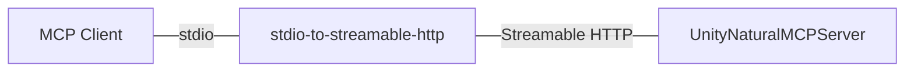

# UnityNaturalMCP

[English](README.md)

UnityNaturalMCPは、"ナチュラル"な使い勝手を目指した、Unity向けのMCPサーバー実装です。

Unity C#で定義したMCPツールを、ダイレクトにClaudeCodeやCursorなどのMCPクライアントから利用できます。

## Features
- Unity EditorとMCPクライアント間の簡潔な通信フロー
- stdio/Streamable HTTP対応
- [ModelProtocolContext C#SDK](https://github.com/modelcontextprotocol/csharp-sdk)を用いた、C#で完結する拡張MCPツールの実装
- ClaudeCode対応

## Architecture


### UnityNaturalMCPServer
Unity Packageとして提供される、Streamable HTTPとして振る舞うMCPサーバー実装です。

Streamable HTTP対応のクライアントであれば、これを介して単体でUnity Editorと通信することができます。

### stdio-to-streamable-http
Node.jsで実装された、MCPクライアントとUnity間の通信を中継するstdioベースのMCPサーバーです。

ClaudeCodeなどの一部のMCPクライアントは、Streamable HTTPに対応していません。

stdioの入力をStreamable HTTPにバイパスすることで、UnityNaturalMCPServerとMCPクライアントの間の通信を可能にします。

### UnityNaturalMCPTest
機能検証用、サンプルとなるUnityプロジェクトです。

## MCP Tools
現在、次のMCPツールが実装されています。

- **RefreshAssets**: Unity Editorのアセットを更新
- **GetLogHistory**: Unity Consoleのログ履歴を取得

## Requirements
- Unity 6000.0
- Node.js

## Installation

### Unity
動作には、次のPackageが必要です。
- [UniTask](https://github.com/Cysharp/UniTask)
- [NugetForUnity](https://github.com/GlitchEnzo/NuGetForUnity)

また、NugetForUnityより、次のNuget Packageをインストールしてください。
- [System.Text.Json](https://www.nuget.org/packages/System.Text.Json/)
- [ModelContextProtocol](https://www.nuget.org/packages/ModelContextProtocol/)
- [Microsoft.Extensions.DependencyInjection](https://www.nuget.org/packages/Microsoft.Extensions.DependencyInjection/)

> [!WARNING]
> ModelContextProtocolはまだpreview段階です。NugetForUnityを介して導入する場合、`Show Prerelease`トグルを有効化する必要があります。

UPM(Unity Package Manager)を介してインストールできます。

- `Packages/manifest.json` を編集
- `dependencies` セクションに以下を追加：
  ```json
  "jp.notargs.unity-natural-mcp": "https://github.com/notargs/UnityNaturalMCP.git?path=/UnityNaturalMCPServer"
  ```

### Initial Setup
1. Unity Editorで`Edit > Preferences > Unity Natural MCP`を開く
2. MCPサーバーのポート番号を設定（デフォルト: 8090）
3. `Refresh` ボタンをクリックして設定を反映

### Claude Code
RepositoryをCloneし、`node`に`stdio-to-streamable-http/src/index.js`を渡してサーバーを起動します。
`MCP_SERVER_IP` `MCP_SERVER_PORT` 環境変数を介して、接続先のIPアドレスとポートを指定することができます。
```
{
  "mcpServers": {
    "unity-natural-mcp": {
      "command": "node",
      "args": ["path/to/stdio-to-streamable-http/src/index.js"],
      "env": {
        "MCP_SERVER_IP": "localhost",
        "MCP_SERVER_PORT": "8090"
      }
    }
  }
}
```

### WSL2
Windows上でClaude Codeなどを用いてMCPを利用する場合、WSL2を利用する必要があります。

WSL2とUnityの連携を行うためには、WSL2とホストOSのネットワーク設定を適切に行う必要があります。

簡単なアプローチは、ミラーモードを使用して、WSL2とホストOSを接続する方法です。

ミラーモードを有効化するためには、`C:/Users/[username]/.wslconfig`へと以下の設定を追加します。
```ini
[wsl2]
networkingMode=mirrored
```

ミラーモードでは、localhostを介してWSL2とホストOSの間で通信することができます

しかしながら、C#サーバー側でlocalhostにバインドした場合、期待通りに動作せず、接続が失敗する場合があります。

これを回避するためには、Unityの`Edit > Preferences > Unity Natural MCP`より、IPAddressを`*`に設定し、`Refresh`を実行します。

> [!CAUTION]
> セキュリティ上の観点から、IP Addressに`*`を指定することは本来推奨されません。
> こちらはあくまで簡易的なセットアップ手順を示すものです。
> 環境に応じて、適宜調整を行ってください。

## Custom MCP Tool Implementation

### 1. Create MCP Tool
UnityNaturalMCPでは、[ModelProtocolContext C#SDK](https://github.com/modelcontextprotocol/csharp-sdk)を用いて、C#でMCPツールを実装することができます。

Editor用のasmdefを作成し、次のスクリプトファイルを追加します。

```csharp
using UnityEngine;
using UnityNaturalMCP.Editor.Attributes;
using System.ComponentModel;

[McpServerToolType, Description("カスタムMCPツールの説明")]
public class MyCustomMCPTool
{
    [McpServerTool, Description("メソッドの説明")]
    public string MyMethod()
    {
        return "Hello from Unity!";
    }
}
```

> [!TIP]
> 非同期処理を定義する際は、メインスレッド以外から呼び出される可能性を考慮する必要があります。

```csharp
[McpServerTool, Description("非同期処理の例")]
public async UniTask<string> AsyncMethod()
{
    await UniTask.SwitchToMainThread();
    await UniTask.Delay(1000);
    return "非同期処理完了";
}
```

### 2. Create MCP Tool Builder
MCPツールをMCPサーバーに登録するためには、`McpBuilderScriptableObject`を継承したクラスを作成します。
```csharp
using UnityEngine;
using UnityNaturalMCP.Editor;

[CreateAssetMenu(fileName = "MyCustomMCPToolBuilder", 
                 menuName = "UnityNaturalMCP/My Custom Tool Builder")]
public class MyCustomMCPToolBuilder : McpBuilderScriptableObject
{
    public override void Build(IMcpServerBuilder builder)
    {
        builder.WithTools<MyCustomMCPTool>();
    }
}
```


### 3. ScriptableObjectの作成
1. Unity Editorでプロジェクトウィンドウを右クリック
2. `Create > UnityNaturalMCP > My Custom Tool Builder` を選択
3. `Edit > Preferences > Unity Natural MCP > Refresh` から、MCPサーバーを再起動すると、作成したツールが読み込まれます。

## ライセンス

MIT License